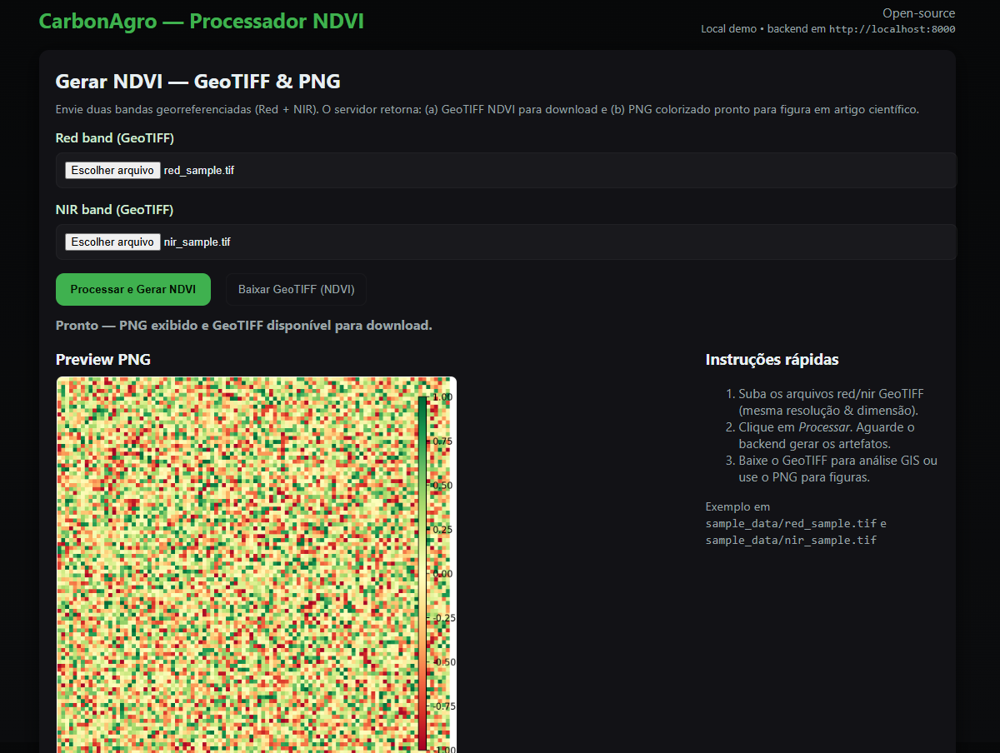

## CarbonAgro — Informações

Este é um projeto open-source com o objetivo de incluir várias áreas do conhecimento. Sinta-se à vontade para colaborar de qualquer forma que seja!

Segue abaixo a tela inicial do aplicativo.


## Introdução
<div align="justify">

O CarbonAgro é um produto tecnológico orientado às Ciências Ambientais que integra sensoriamento remoto, modelagem ecológica, geoprocessamento e ciência de dados para estimar, monitorar e comunicar o sequestro de carbono em sistemas agrícolas, pecuários e agroflorestais no Brasil. Seu propósito é fornecer uma plataforma aberta, auditável e cientificamente robusta que auxilie pesquisadores, técnicos e produtores rurais na quantificação de biomassa, carbono e emissões evitadas, promovendo maior transparência em iniciativas de MRV — Monitoring, Reporting and Verification (Monitoramento, Relato e Verificação).

O aplicativo fundamenta-se no uso de índices espectrais, especialmente o NDVI — Normalized Difference Vegetation Index (Índice de Vegetação por Diferença Normalizada), derivado das bandas Red e NIR — Near-Infrared (Infravermelho Próximo) de sensores orbitais como Sentinel-2 e Landsat 8/9. Esses índices são amplamente utilizados na literatura para estimar vigor da vegetação, produtividade primária, padrões fenológicos e tendências de degradação. A partir desses dados, o sistema permite derivar estimativas de biomassa, carbono (tC — toneladas de Carbono) e equivalência de dióxido de carbono (tCO₂e — toneladas de dióxido de carbono equivalente), utilizando fatores padrão e equações alométricas.

O projeto dialoga diretamente com temas centrais das Ciências Ambientais, incluindo mudanças climáticas, conservação do solo, serviços ecossistêmicos, dinâmica do uso da terra (LULUCF — Land Use, Land-Use Change and Forestry), agricultura sustentável, monitoramento de pastagens e modelagem de estoques de carbono. A quantificação do sequestro de carbono é um dos principais elementos de políticas públicas de mitigação climática e de iniciativas privadas como créditos de carbono, ABC+, REDD+ e Pagamentos por Serviços Ambientais (PSA). Dessa forma, o CarbonAgro contribui para reduzir incertezas, padronizar metodologias e democratizar o acesso a ferramentas científicas avançadas.

Em um contexto global no qual a agricultura brasileira desempenha papel crítico tanto nas emissões quanto no potencial de remoção de CO₂, um sistema aberto e colaborativo torna-se essencial para garantir integridade ambiental, rastreabilidade metodológica e capacidade de auditoria independente. O CarbonAgro promove a interconexão entre tecnologia, ciência ambiental e sustentabilidade, fornecendo uma base replicável e expansível para mensurar variações de biomassa ao longo do tempo, simular cenários de manejo, apoiar políticas de baixa emissão de carbono e contribuir para um uso mais eficiente e responsável do território.
</div>

## 1. Objetivo
O CarbonAgro foi concebido para fornecer estimativas replicáveis e transparentes de estoques e fluxos de carbono em áreas agropecuárias e agroflorestais. O objetivo aqui é documentar, em nível de artigo científico, a metodologia empregada para cálculo de NDVI, conversão para biomassa/estoque de carbono, protocolo de validação e estimativa de incertezas.

Este documento dá suporte para:
- Autores que queiram incluir figuras/figuras de mapa (PNG) em artigos;
- Pesquisadores que procuram uma referência inicial de pipeline;
- Desenvolvedores que queiram estender o sistema com modelos regionais ou nacionais.

---

## 2. Proposta do App
Oferecer:
- Pipeline reproduzível para gerar índices vegetacionais (NDVI, EVI) a partir de bandas multispectrais (Sentinel-2, Landsat).
- Ferramentas de inventário local (coleta de DAP, altura, espécie) para alimentar equações alométricas.
- Módulos para projeção de cenários de manejo e produção de relatórios com incertezas.


## 3. Metodologia que pode ser utilizada

### 3.1 Aquisição de imagens remotas
- Preferência: Sentinel-2 (10m) para NDVI, Landsat 8/9 (30m) como série temporal histórica.
- Janela temporal: selecionar imagens na estação desejada (ex.: período seco / chuvoso), e idealmente usar composição de mediana para reduzir ruído de nuvens.
- Correções recomendadas: correção atmosférica (Sen2Cor para Sentinel-2) e máscara de nuvens (QA60 ou Fmask).

### 3.2 Pré-processamento
1. Reprojetar imagens para uma projeção comum (ex.: EPSG:4326 para visualização, EPSG:32723/24 para áreas Brasil centro-oeste conforme UTM).
2. Aplicar máscara de nuvens e sombras.
3. Criar mosaico / composição temporal (média/mediana/percentil) para a janela de interesse.
4. Garantir alinhamento espacial (mesma resolução e dimensão) das bandas Red e NIR.

### 3.3 Cálculo de índices
- NDVI = (NIR - Red) / (NIR + Red)
- EVI = 2.5 * (NIR - Red) / (NIR + 6*Red - 7.5*Blue + 1)  (opcional)
- Calcule médias, desvio e métricas por parcela/polígono.

### 3.4 Estimativa de biomassa e carbono
- Para árvores: usar equações alométricas regionais (por espécie ou gênero). Fórmula geral:
  - B = a × DAP^b × H^c
  - Onde B = biomassa arbórea (kg ou t), DAP = diâmetro à altura do peito (cm), H = altura (m).
- Biomassa de raízes: usar fator raiz/parte aérea (tipicamente 0.2–0.3).
- Conversão para carbono: tC = Biomassa × fc , com fc ≈ 0.47 (faixa 0.45–0.5 dependendo da espécie).
- Conversão para CO₂e: tCO₂e = tC × 44/12 ≈ tC × 3.6667.

**Nota:** A correlação NDVI ↔ biomassa é altamente dependente do sistema (florestas densas saturam NDVI; em pastagens a relação é diferente). NDVI sozinho não substitui inventário de campo para estoques absolutos, mas é útil para variação temporal e monitoramento relativo.

---

## 4. Equações e conversões utilizadas para a montagem
- NDVI = (NIR − Red) / (NIR + Red)
- Conversões:
  - tC = Biomassa_total × 0.47
  - tCO₂e = tC × 44/12

- Exemplos de equações alométricas (genéricas — ajustar por bioma/região):
  - B = 0.0673 × (DAP^2 × H)^0.976 (modelo genérico tropical; verificar regressões locais)

---

## 5. Desenho amostral para validação de campo
Objetivo: calibrar e validar modelos/estimativas remotas.

1. **Estratificação** — estratificar a área por uso do solo (pastagem, SAF, cultura, remanescente arbóreo).
2. **Amostragem** — amostragem aleatória dentro de cada estrato; número de parcelas depende da variabilidade:
   - Recomendação inicial: 30 parcelas por estrato para estimativas locais com erro padrão razoável.
3. **Tamanho de parcela** — 10m × 10m para pastagens; 20m × 20m para mosaicos arbóreos; 0.1 ha (31.62 m radius) para inventários florestais padrão (censo por árvore).
4. **Medições em cada parcela**:
   - Contar árvores > 5 cm DAP, medir DAP e altura (ou estimar altura por clinômetro).
   - Amostras de biomassa herbácea (clip quadrante) para pastagens.
   - Amostra de solo (0–30 cm) para carbono orgânico (opcional).

**Relatório mínimo por parcela**:
- Coordenadas (UTM), data, uso do solo, DAP e altura por árvore, biomassa herbácea, observações.

---

## 6. Propagação de incertezas
Use Monte Carlo para propagar incertezas nos parâmetros:

1. Assuma distribuições para parâmetros incertos: por exemplo
   - fc (fração de carbono) ~ Normal(0.47, 0.02)
   - coeficientes alométricos (a, b, c) ~ Normal(valor, sd)
   - erro de medição DAP ~ Normal(0, sd)
2. Para cada parcela, execute N simulações (ex.: N=1000) amostrando parâmetros e recomputando biomassa → tC → tCO₂e.
3. Calcule intervalos de confiança (2.5%–97.5%) e reporte medianas e desvios padrão.

**Erro remoto**:
- Inclua incerteza por erro de classificação de uso do solo (ex.: matriz de confusão).
- Propague incerteza de NDVI → biomassa (se houver modelo estatístico) — inclua RMSE do modelo como fonte de erro.

---

## 7. Sugestôes do autor para apresentação
- **Figura de mapa**: use a imagem PNG gerada com colorbar; legenda: “NDVI (Sentinel-2), composição mediana, janela [dd/mm/yyyy — dd/mm/yyyy]. Média NDVI = X (σ = Y).”
- **Tabela**: resumo de estoques por estrato (tC/ha, tCO₂e/ha), N parc., intervalo de confiança 95%.
- **Metodologia**: documentar correções atmosféricas, QA (máscara de nuvens), versão de dados (Sentinel-2 L2A), equações alométricas com referências.

---

## 8. Fontes de dados sugeridas
- Sentinel-2: Copernicus Open Access Hub.
- Landsat Collection: USGS EarthExplorer.

---

## 9. Comandos para rodar em localhost
### Dependências de sistema (Linux/Windows)
- GDAL / PROJ (via instalador ou wheels)
- Python 3.8+

### Instalação (Windows PowerShell)
```powershell
python -m venv venv
.\venv\Scripts\activate
pip install --upgrade pip
pip install -r backend/requirements.txt

